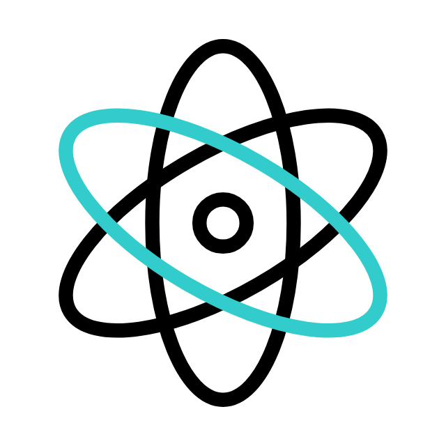

# Hi there , I'm Tom

## About me
I'm a computational linguist who loves web development

## I'm currently working on...
My [second React project](https://github.com/tomduranti/product_list_with_cart) where I am mastering state management and global variables

## 🌱 I’m currently learning ...
React for the next 1-2 months, then I am focusing on accessibility

## 👯 I’m looking to collaborate on ...
Oopen source projects relevant to frontend technologies, but not until I am done with learning React!
